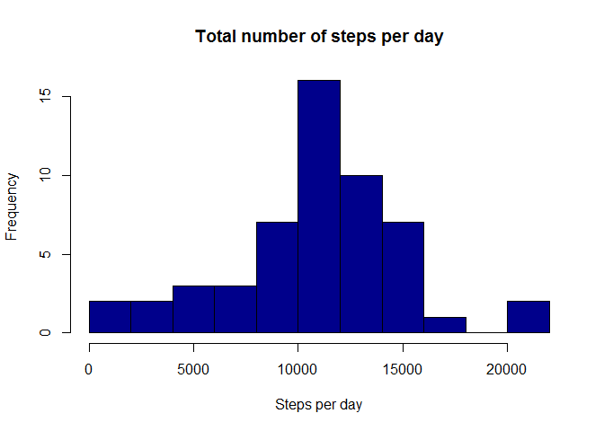
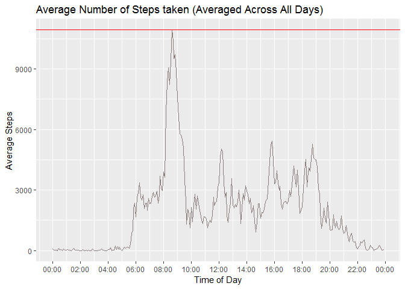
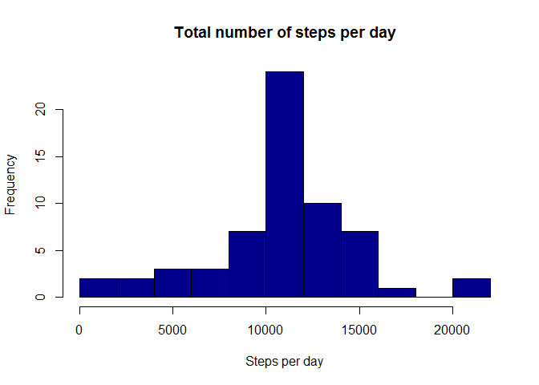
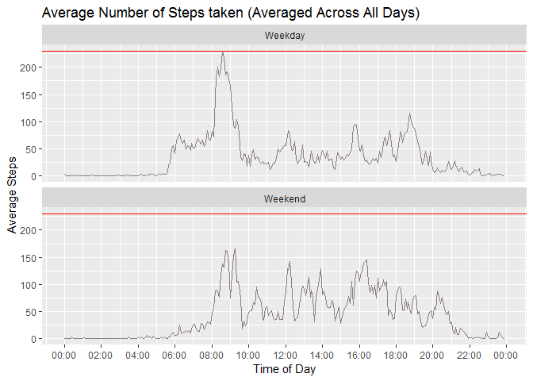

---
output:
  html_document: 
    keep_md: yes
  word_document: default
---
# Reproducible Research
## Week 2 - Course Project 1

This was the first assignment for the Reproducible Research course in Coursera’s Data Science Specialization track.

## Introduction

This assignment makes use of data from a personal activity monitoring device. This device collects data at 5 minute intervals through out the day. The data consists of two months of data from an anonymous individual collected during the months of October and November, 2012 and include the number of steps taken in 5 minute intervals each day.

The variables included in this dataset are:

steps: Number of steps taking in a 5-minute interval NA)
date: The date on which the measurement was taken in YYYY-MM-DD format
interval: Identifier for the 5-minute interval in which measurement was taken


## Answering the questions:

### 1. What is mean total number of steps taken per day?

To make the consolidation by date we need to use the code:


```r
step_data <-aggregate(steps~date,data,sum)
```

Histogram of the total number of steps taken each day

<!-- -->

```
## [1] "The mean of the total number of steps taken per day is 10766.1886792453 and the median is 10765"
```


## 2. What is the average daily activity pattern?

In order to make this consolidation works I grouped de data into groups of intervals. In addition I've created the column Time using the interval to make it easiar to look in the plot.I used ggplot to make the time serie.


```r
interval <- data %>% 
  filter(!is.na(steps)) %>% 
  group_by(interval) %>% 
  summarize(steps = sum(steps))

interval$Time<-dmy_hm(paste("1/1/1900_",paste(substr(10000+interval$interval,2,3),substr(10000+interval$interval,4,5),sep=":")))


ggplot(interval, aes(x=Time, y=steps)) +
  geom_line(color = "mistyrose4") +
  scale_x_datetime(breaks = date_breaks("2 hour"), 
                   labels = date_format("%H:%M"),
                   limits = c(interval$Time[1], interval$Time[288])) +
  labs(title = "Average Number of Steps taken (Averaged Across All Days)", 
       x = "Time of Day", 
       y = "Average Steps")+
  geom_hline(yintercept=max(interval$steps), color="red")
```

<!-- -->

## 3. Which 5-minute interval, on average across all the days in the dataset, contains the maximum number of steps?

To answer this question I put a red line on the plot and made a computational query. The result is printed above.


```r
max.interval <- interval[which.max(interval$steps),]
paste("The interval with the maximum number of steps is",
      round(max.interval$steps[1]), "at",
      max.interval$Time[1])
```

```
## [1] "The interval with the maximum number of steps is 10927 at 1900-01-01 08:35:00"
```

## 4. Calculate and report the total number of missing values in the dataset 


```r
miss<-sum(is.na(data$steps))
paste("The number of missing values is",miss)
```

```
## [1] "The number of missing values is 2304"
```

## 5. Devise a strategy for filling in all of the missing values in the dataset.

My strategy was fill the NAs using the mean in if the other days in the same interval.


```r
data_complete <- data
missing_data <- is.na(data_complete$steps)
mean_interval <- tapply(data_complete$steps,
                        data_complete$interval, 
                        mean, na.rm=TRUE, simplify=TRUE)

data_complete$steps[missing_data] <- mean_interval[as.character(data_complete$interval[missing_data])]
```


## 6. Make a histogram of the total number of steps taken each day and Calculate and report the mean and median total number of steps taken per day. Do these values differ from the estimates from the first part of the assignment? 


```r
step_data_complete <-aggregate(steps~date,data_complete,sum)

hist(step_data_complete$steps,breaks=8,main="Total number of steps per day", xlab="Steps per day",col="dark blue")
```

<!-- -->


# 7. What is the impact of imputing missing data on the estimates of the total daily number of steps?


```r
mean2<-mean(step_data_complete$steps)
median2<-median(step_data_complete$steps)
```

The mean and median of the total number of steps taken per day is the same in both cases but frequency increases

## 8. Are there differences in activity patterns between weekdays and weekends?

Create a new factor variable in the dataset with two levels – “weekday” and “weekend” indicating whether a given date is a weekday or weekend day.


```r
data_complete<-mutate(data_complete,weektype = ifelse(weekdays(data$Date_Time)%in%c("sábado","domingo"),"Weekend","Weekday"))
data_complete$weektype <- as.factor(data_complete$weektype)
```

## 9. Make a panel plot containing a time series plot (i.e.type="l") of the 5-minute interval (x-axis) and the average number of steps taken, averaged across all weekday days or weekend days (y-axis).


```r
data.wkd <- data_complete %>%
  group_by(interval, weektype) %>%
  summarise(steps = mean(steps))

data.wkd$Time<-dmy_hm(paste("1/1/1900_",paste(substr(10000+data.wkd$interval,2,3),substr(10000+data.wkd$interval,4,5),sep=":")))

ggplot(data.wkd, aes(x=Time, y=steps, color = weektype)) +
  geom_line(color = "mistyrose4") +
  facet_wrap(~weektype, ncol = 1, nrow=2)+
  scale_x_datetime(breaks = date_breaks("2 hour"), 
                   labels = date_format("%H:%M"),
                   limits = c(min(data.wkd$Time), max(data.wkd$Time))) +
  labs(title = "Average Number of Steps taken (Averaged Across All Days)", 
       x = "Time of Day", 
       y = "Average Steps")+
  geom_hline(yintercept=max(data.wkd$steps), color="red")
```

<!-- -->

Looking at the graphics seems that during weekdays, there is a peak of steps around 8:30 but in the rest of the day the number of steps is under 100 by interval. On the other hand, during weekends the peak is lower and there is a spread of the distriibution of steps during the rest of the day. 
